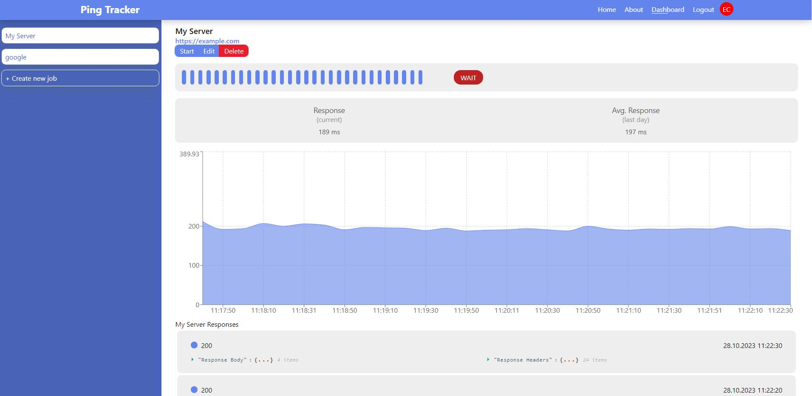

# Ping Tracker

Ping Tracker is health check application.

## Overview

With Ping Tracker, you can monitor your servers and web applications, see error times, and check your response body and headers. You can customize the request you want to send according to your own application and run multiple requests simultaneously. Since it has an auth system, you can be sure that the user is only viewing jobs linked to that user.

## Features

- Trash can

  - With the trash bin, even if the user deletes a job, he will have the ability to revive it within a certain period of time.
  - User will have the ability to delete deleted jobs within a certain period of time
  - If the user deletes a job and revives it, user will be able to take it back with the responses.

- Alert system

  - With this system, if the user receives a different response than expected, user will be instantly informed of the situation.

- Time Filter

  - The user will be free to view any time period they want and will be able to easily examine what is wrong with their past requests.

- File System

  - With this system, user will be able to create self file structures with user's choices

- Responsive Design
  - Application not fully responsive right now. With fully responsive support application will be compatible with every device size.

## Structure of the application

Ping Tracker has 3 main components.

1. [**Ping Tracker Service**](https://github.com/emrecanterzi/ping-tracker-service)
   - This component ensures that requests are sent and responses are written to the database in the background and decides which operations to execute.
2. [**Ping Tracker API**](https://github.com/emrecanterzi/ping-tracker-api)

   - This component is the connection between the database and the frontend. Responds to user requests.

3. [**Ping Tracker Frontend**](https://github.com/emrecanterzi/ping-tracker-frontend)
   - This component is the interface through which the user performs operations. Here user sees the responses and can edit the jobs he wants or create a new one.
